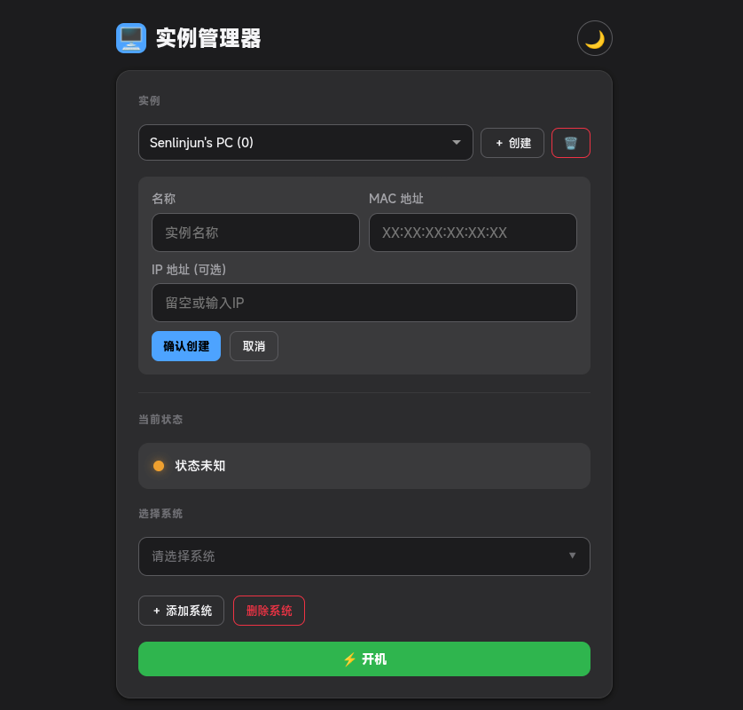

# WMDG

WOL on Mulit-system Device based on GRUB

一个能让你使用家中闲置的常开机设备管理唤醒多系统设备的方案

***目前需要设备中至少有一个Linux系统***

## 安装及运行

***双端均需要python3环境*** **

### Server端

以闲置常开机设备作为server端

```bash
git clone https://github.com/senlinjun/WMDG.git
cd WMDG/server
pip3 install -r requirement.txt
```

参考server目录下的`config_sample.json`编写自己的`config.json`文件

E.g. :

```json
# config.json
{
    "username": "admin",
    "password": "admin123",
    "instances": {},
    "SECRET_KEY": "6550acc44f93f611270b414711fb6c06004603d60cb47f2b3910992c7433724aec"
}
```

运行即可

```bash
python3 -m flask run --host 0.0.0.0
```

接下来登录该设备下的5000端口访问控制面板


我们需要：

1. 创建实例，其中IP地址可留空，不影响启动，只需要正确填写MAC地址即可
2. 创建系统，填写该系统在GRUB内的顺序(从0开始)

### Client端

***注意：设备上的每一个系统都需要开启WOL***

我们需要将任意一个Linux系统作为GRUB的默认启动项，并使其启动时自动运行切换系统脚本

```bash
# 请不要把该项目放在/home目录下，否则会触发SELINUX的保护机制导致无法切换系统
# 该教程以/opt/WMDG作为目录为例
git clone https://github.com/senlinjun/WMDG.git
cd WMDG/client
pip3 install -r requirement.txt
```

参考client目录下的`config_sample.json`编写自己的`config.json`文件。其中有关`attempt`的字段是为了等待系统联网

E.g. :

```json
{
    "server": "192.168.1.45:5000", # Server端
    "instance_id": 0, # 表示该设备的实例号
    "order": 0, # 表示当前系统在GRUB的顺序
    "attempt": 10, # 表示最多重试次数
    "attempt_second": 3 # 表示重试的间隔时间
}
```

接下来编写systemd服务

```service
#/etc/systemd/system/wol-client.service

[Unit]
Description=Run WOL client script
After=network-online.target

[Service]
Type=simple
User=root
WorkingDirectory=/opt/WMDG/client
ExecStart=python3 main.py

[Install]
WantedBy=multi-user.target
```

启用该service

```bash
sudo systemctl daemon-reload
sudo systemctl enable wol-client
```
